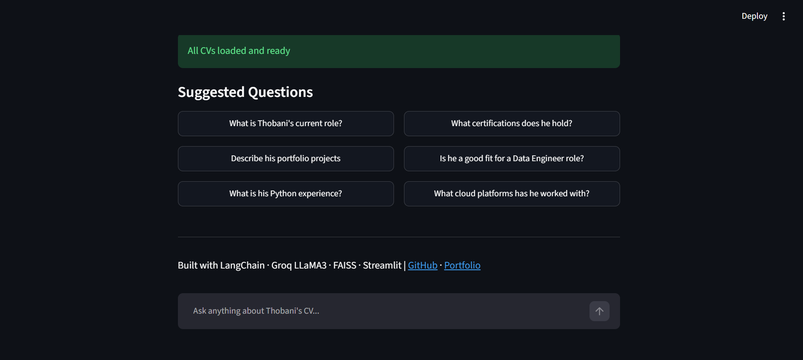
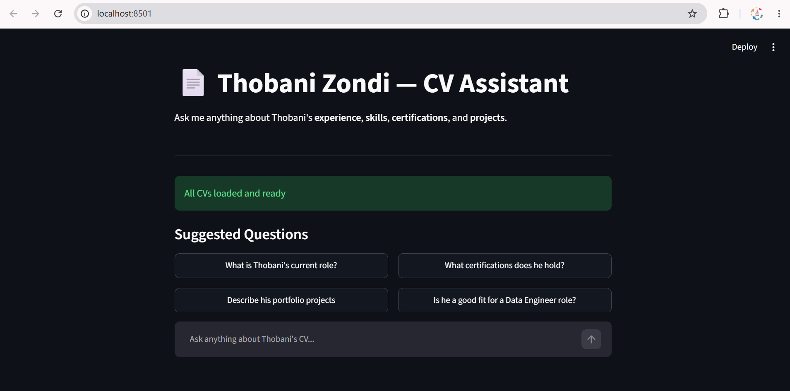
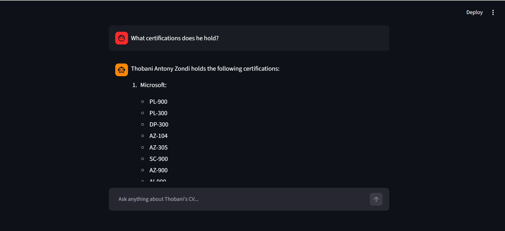

#  CV RAG Assistant — Thobani Antony Zondi

An AI-powered Retrieval-Augmented Generation (RAG) application that reads multiple versions of my CV and answers questions about my experience, skills, and projects using Google Gemini and LangChain.

---

## How It Works

```
CV PDFs → Text Extraction → Chunking → Vector Embeddings
→ FAISS Vector Store → User Question → Similarity Search
→ Relevant Chunks + Question → Google Gemini → Answer
```

---

## Architecture

| Layer | Tool | Purpose |
|---|---|---|
| Document Loading | PyPDF | Extract text from CV PDFs |
| Text Splitting | LangChain RecursiveCharacterTextSplitter | Split into 500-char chunks |
| Embeddings | HuggingFace all-MiniLM-L6-v2 | Convert text to vectors locally |
| Vector Store | FAISS | Store and search vectors |
| LLM | Google Gemini 1.5 Flash | Generate answers |
| Orchestration | LangChain RetrievalQA | Connect all components |
| UI | Streamlit | Interactive chat interface |

---

## Project Structure

```
cv-rag-assistant/
├── cv_data/                     # CV PDF documents
│   ├── thobani-zondi.pdf
│   ├── zondi-thobani.pdf
│   └── thobani-antony-zondi.pdf
├── retrieval_engine/            # RAG pipeline logic
│   └── rag_engine.py            # Document loading, vector store, QA chain
├── dashboard/                   # Streamlit UI layer
│   └── app.py                   # Interactive chat interface
├── .env                         # API keys (not committed to GitHub)
├── .gitignore                   # Excludes sensitive and unnecessary files
├── requirements.txt             # Python dependencies
└── README.md                    # Project documentation
```

---

## Getting Started

### 1. Clone the repository
```bash
git clone https://github.com/thobanizondi/cv-rag-assistant.git
cd cv-rag-assistant
```

### 2. Create and activate virtual environment
```bash
python -m venv venv --without-pip
source venv/Scripts/activate
curl https://bootstrap.pypa.io/get-pip.py -o get-pip.py
python get-pip.py
```

### 3. Install dependencies
```bash
pip install -r requirements.txt
```

### 4. Set up environment variables
Create a `.env` file in the root folder:
```
GOOGLE_API_KEY=your_google_gemini_api_key_here
```
Get your free API key at: https://aistudio.google.com

### 5. Add your CV PDFs
Place your CV PDF files in the `cv_data/` folder.

### 6. Run the application
```bash
streamlit run dashboard/app.py
```

Open your browser at `http://localhost:8501`

---

## 💬 Example Questions

- What is Thobani's current role?
- What certifications does he hold?
- Describe his portfolio projects
- What is his Python experience?
- Is he a good fit for a Data Engineer role?
- What cloud platforms has he worked with?
- What data engineering tools does he use?

---

## 🛠️ Tech Stack

- **Python 3.12**
- **LangChain** — RAG orchestration framework
- **Google Gemini 1.5 Flash** — Large Language Model (free tier)
- **FAISS** — Facebook AI Similarity Search vector database
- **HuggingFace Sentence Transformers** — Local embedding model
- **PyPDF** — PDF text extraction
- **Streamlit** — Web UI framework

---

## RAG Pipeline Detail

### Document Ingestion
All PDF files in the `cv_data/` folder are automatically detected and loaded. Each CV is labelled with its source filename so the model knows which document the information came from.

### Chunking Strategy
Text is split into 500-character chunks with 50-character overlap. The overlap ensures context is not lost at chunk boundaries — important for extracting complete sentences about skills and experience.

### Embedding Model
Uses `all-MiniLM-L6-v2` from HuggingFace — a lightweight, fast embedding model that runs entirely locally on your machine with no API cost.

### Retrieval
On each question, FAISS retrieves the 5 most semantically similar chunks from the vector store. These chunks are injected into the prompt as context for Gemini to answer from.

---

## About

**Thobani Antony Zondi**
Data Engineer | SQL Database Developer
Johannesburg, South Africa

- 🌐 Portfolio: [datascienceportfol.io/thobanizondi](https://datascienceportfol.io/thobanizondi)
- 💼 GitHub: [github.com/thobanizondi](https://github.com/thobanizondi)
- 🔗 LinkedIn: [linkedin.com/in/thobani-zondi](https://linkedin.com/in/thobani-zondi)

---

## Screenshots

### Dashboard


### Chat Interface


### Sample Answer
